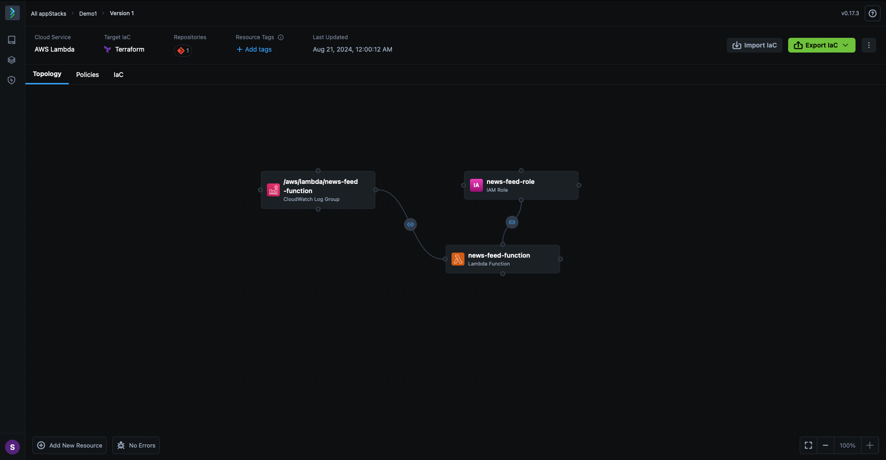

<a href="https://appCD.com"></a>
<a href="https://docs.appCD.io/getting-started"></a>


##  Demo 1 - Newfeeds AWS lambda application 

#### Step 1 : Open appcd portal via cloud.app.io 


#### Step2 : login with your creditionals 

```
git clone https://github.com/appcd-demo/news-feed 
cd news-feed 
sh build.sh 
✗ ls
Pipfile  build.sh main.py  main.zip package
```

#### Let's Onboard Your Repositories


### Add Public Repositories 


### Create appstack 


### Select AppStack from Source Code 
> 1. ✅ Checkmark Repo 
> 2. add required details such as compoment name analyzing path 
> 3. Container Registory 
> 4. Dockerfile path 


> 5. Click on proceed 


### Select Cloud Service ( where you want to deploy your application base )


> Select AWS Lambda ( because our application is AWS lambda python Application )


## apply Security Policies base on Services 


### AppStack will analyze your application 


### Expand app view 


> click on veriosn 1 


### Visualize your deployment architecture 





> Click on news-feed function 


>  


add Filename as `main.zip`

> Create Function URL set as `true` 


### Export the IaC from appStack 


### create terraform folder and unzip and add to terraform folder 


```
(base) ➜ makdir terraform 
(base) ➜ cd terraform 
(base) ➜  terraform git:(main) ✗ ls


### add generated main.zip here 

README.md         modules           outputs.tf        terraform.tfstate
main.zip          modules.tf.json   provider.tf       variables.tf

```

### export your AWS keys

```
export AWS_ACCESS_KEY_ID 
export AWS_SECRET_ACCESS_KEY
export AWS_SESSION_TOKEN
```

### terraform init 

```
(base) ➜  terraform git:(main) ✗ terraform init                                 

Initializing the backend...
Initializing modules...

Initializing provider plugins...
- Reusing previous version of hashicorp/aws from the dependency lock file
- Using previously-installed hashicorp/aws v5.63.1

Terraform has been successfully initialized!

You may now begin working with Terraform. Try running "terraform plan" to see
any changes that are required for your infrastructure. All Terraform commands
should now work.

If you ever set or change modules or backend configuration for Terraform,
rerun this command to reinitialize your working directory. If you forget, other
commands will detect it and remind you to do so if necessary.
```


### terraform plan 


```
terraform plan                                 
var.region
  AWS region in which the project needs to be setup (us-east-1, ca-west-1, eu-west-3, etc)

  Enter a value: us-east-1


```

### terraform apply 


```
terraform apply 
var.region
  AWS region in which the project needs to be setup (us-east-1, ca-west-1, eu-west-3, etc)

  Enter a value: us-east-1


Apply complete! Resources: 4 added, 0 changed, 0 destroyed.

Outputs:

aws_cloudwatch_log_group_aws_lambda_news_feed_function_arn = "arn:aws:logs:us-east-1:438465137822:log-group:/aws/lambda/news-feed-function"
aws_cloudwatch_log_group_aws_lambda_news_feed_function_name = "/aws/lambda/news-feed-function"
aws_iam_role_news_feed_role_arn = "arn:aws:iam::438465137822:role/news-feed-role"
aws_iam_role_news_feed_role_name = "news-feed-role"
aws_lambda_news_feed_function_function_arn = "arn:aws:lambda:us-east-1:438465137822:function:news-feed-function"
aws_lambda_news_feed_function_function_name = "news-feed-function"
aws_lambda_news_feed_function_function_url = "https://ue3z4eswm24a6kvncbp3d7joi40mdkqc.lambda-url.us-east-1.on.aws/"
aws_lambda_news_feed_function_invoke_arn = "arn:aws:apigateway:us-east-1:lambda:path/2015-03-31/functions/arn:aws:lambda:us-east-1:438465137822:function:news-feed-function/invocations"

```

### Cheers we deployed our news application 

```
aws_lambda_news_feed_function_function_url = "https://ue3z4eswm24a6kvncbp3d7joi40mdkqc.lambda-url.us-east-1.on.aws

```

### Terraform destroy 

```
terraform destroy
var.region
  AWS region in which the project needs to be setup (us-east-1, ca-west-1, eu-west-3, etc)

  Enter a value: us-east-1 
```
